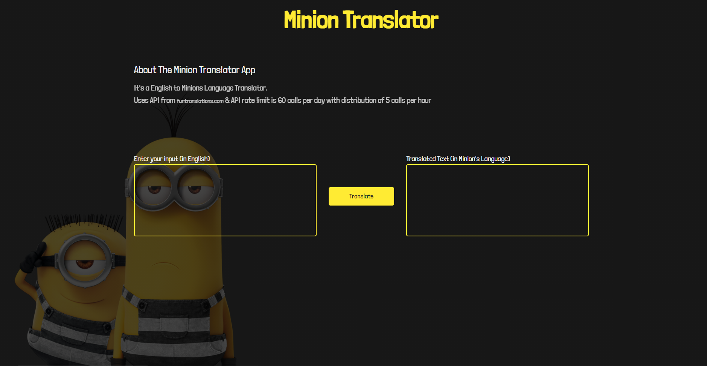

# Minion Translator App

## A English to Minion Language translation app build using vanilla JavaScript

### Neog.camp Lecture 4(Week 3)- Javascript in the browser

#### App URL: (https://miniontranslation-app.netlify.app/)  
#### API URL: (https://funtranslations.com/api/)

---

### Build Using
1. Using FETCH API
2. Created a English to Dothraki Translation App using Fetch API.
3. API rate limit is 60 calls per day with distribution of 5 calls per hour.
